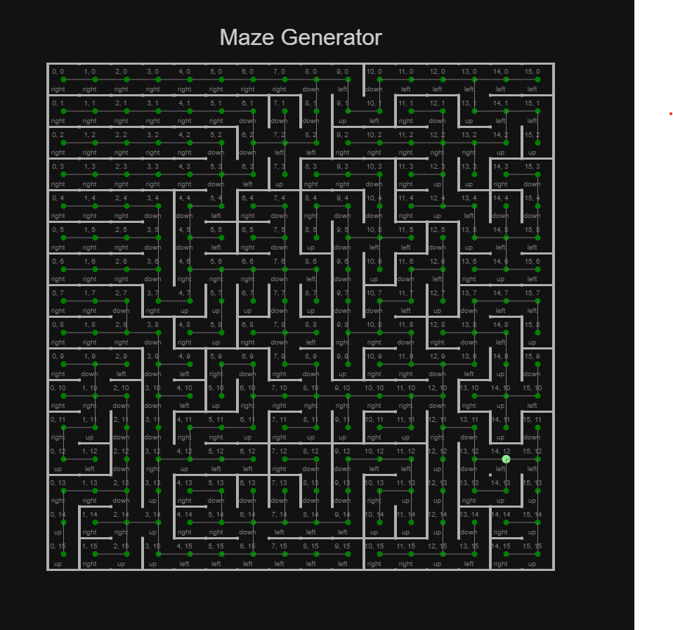
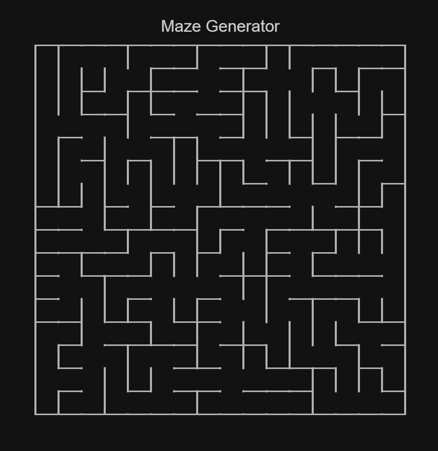

# Maze-Generation

### Introduction:

A simple maze generating algorithm and it's visualization using js. On each refresh, it creates a new perfect maze (a maze where any two cells can be joined by a unique path)

 

### Inspiration:

[Maze Generation in Minecraft](https://www.youtube.com/watch?v=uctN47p_KVk)
